# cq_enclosure_builder
Generate printable enclosures for projects in a few lines of code. Some features:
- Pre-designed common parts (jacks, barrel plug, USBs, etc.);
    - Easy to add your own parts (e.g. the specific model of SPST you're using)
- Screwable lid;
- Layout builder;
- Ready-to-print STL export.

| 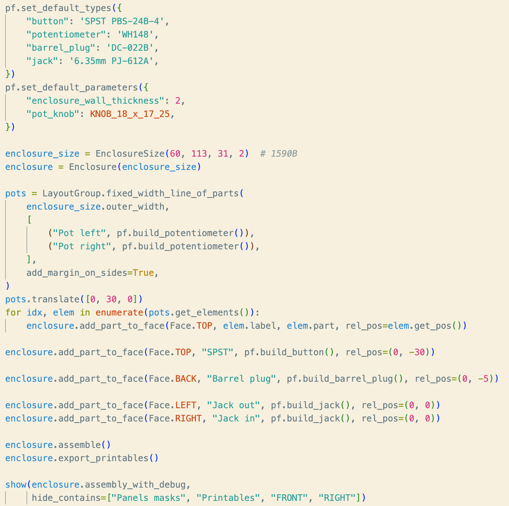<br><sub>Code to generated the model</sub> | 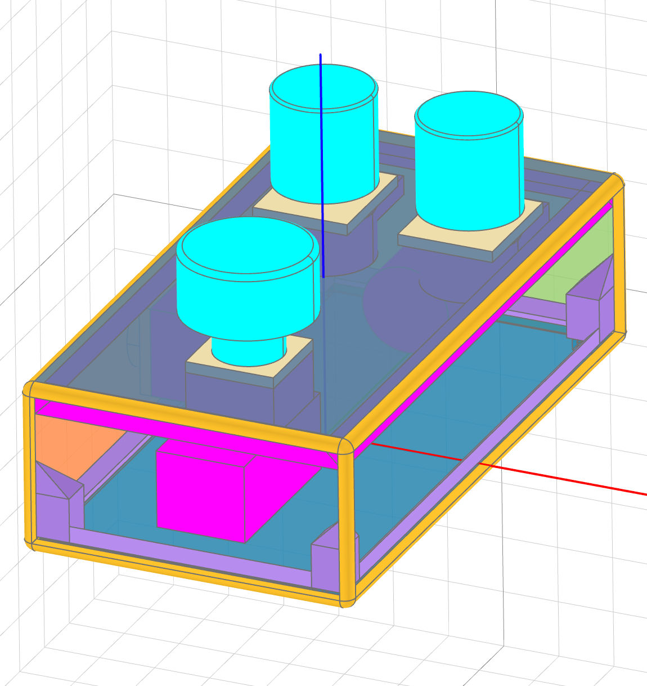<br><sub>Model preview</sub> | 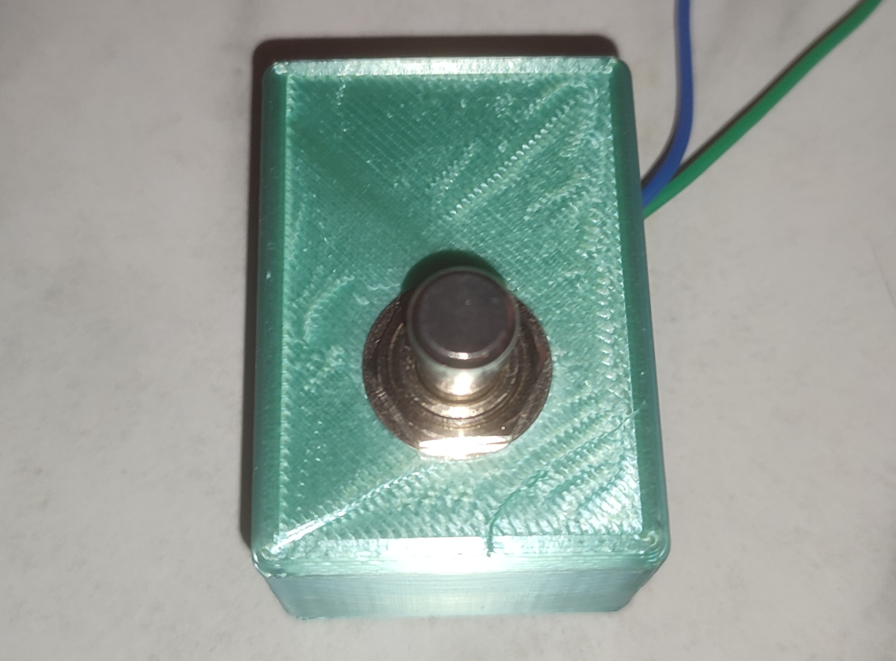<br><sub>TODO IMAGE Printed result</sub> |
|:--------------------------:|:---------------------------:|:----------:|

---

- **[Examples](#examples)**
    - **[01 – Panel with buttons](#example-01)**
    - **[02 – Set default part types and parameters](#example-02)**
    - **[03 – Panel's optional parameters](#example-03)**
    - **[04 – Enclosure with buttons](#example-04)**
    - **[05 – Export enclosure STLs](#example-05)**
    - **[06 – Enclosure's optional parameters](#example-06)**
    - **[07 – Layout builder: simple line](#example-07)**
    - **[08 – Layout builder: fixed-width line](#example-08)**
    - **[09 – Layout builder: fixed-width line with median part centred at 0,0](#example-09)**
    - **[10 – Layout builder: grid of parts](#example-10)**
    - **[11 – Layout builder: combining groups](#example-11)**
    - **[12 – Text](#example-12)**
    - **[13 – Support for parts](#example-13)**
    - **[14 – Support for Raspberry Pi and protoboard](#example-14)**
    - **[15 – Add a new Part](#example-15)**
    - **[16 – All parts](#example-16)**
- **[Available parts](#available-parts)**
    - **[Built-in categories and part types](#available-parts-list-builtins)**
    - **[Adding a new Part](#available-parts-add-new)**
- **[Strength Test](#strength-test)**
    - **[With support](#strength-test)**
    - **[Without support](#strength-test)**
- **[API Reference](#api-reference)**
    - **[Enclosure](#api-reference-enclosure)**
    - **[PartsFactory](#api-reference-parts-factory)**
    - **[LayoutElement](#api-reference-layout-element)**
    - **[LayoutGroup](#api-reference-layout-group)** (layout builder)
    - **[Panel](#api-reference-panel)**
    - **[Part](#api-reference-part)**

---

<a name="examples"></a>
## Examples

To run the [example](./examples/) yourself, you'll need a CadQuery UI, such as [jupyter-cadquery](https://github.com/bernhard-42/jupyter-cadquery) or [cq-editor](https://github.com/CadQuery/CQ-editor). The former is **way** more flexible, but will require you to have a working [Jupyter Notebook/Lab](https://jupyter.org/install) install.

If you haven't installed [CadQuery](https://cadquery.readthedocs.io/en/latest/installation.html) [yet], feel free to check the screenshots below!

([00_all_examples](./examples/00_all_examples.ipynb) contains all the examples in a single Notebook.)

<a name="example-01"></a>
### 01 – Panel with buttons

A single [Panel](#api-reference-panel) (side of an enclosure) with two buttons.

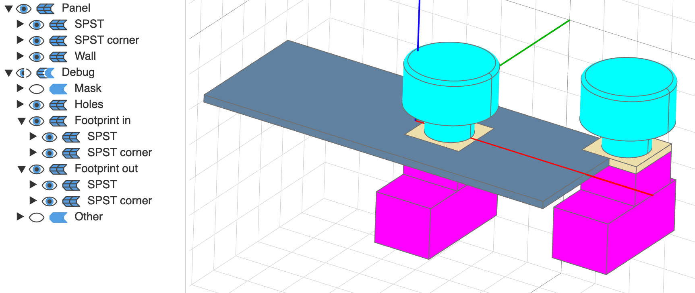
<sub><p align="center">[01_panel_with_button](./examples/01_panel_with_button.py)</p></sub>

<a name="example-02"></a>
### 02 – Set default part types and parameters

Almost the same as above, but shows how `PartsFactory#set_default_types` and `PartsFactory#set_default_parameters` can help you make your code more readable, by removing the need to repeat the `part_type` (e.g. with specific model of SPST you're using for your project), and removing the need to repeat common parameters such as `enclosure_wall_thickness`.

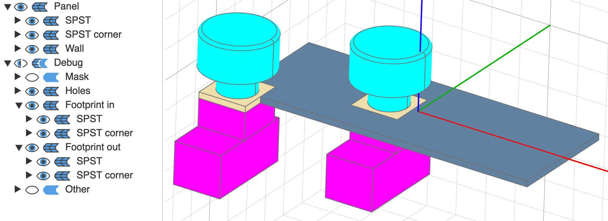
<sub><p align="center">[02_default_part_type_and_parameters](./examples/02_default_part_type_and_parameters.py)</p></sub>

<a name="example-03"></a>
### 03 – Panel's optional parameters

Shows optional parameters for the `Panel` class (see [API Reference](#api-reference-panel)). Here, we've updated the panel colour, the part colour, and the panel's transparency.

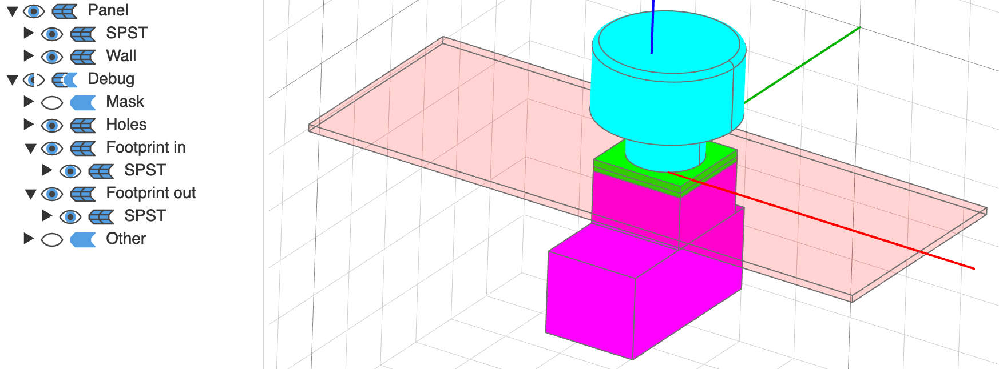
<sub><p align="center">[03_panel_optional_params](./examples/03_panel_optional_params.py)</p></sub>

<a name="example-04"></a>
### 04 – Enclosure with buttons

A simple [Enclosure](#api-reference-enclosure) with an 'exploded' view.

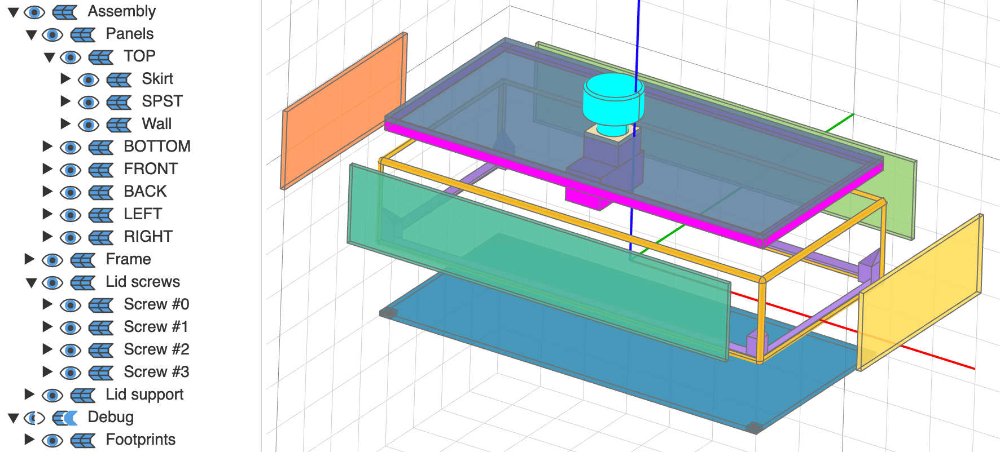
<sub><p align="center">[04_enclosure_with_button](./examples/04_enclosure_with_button.py)</p></sub>

<a name="example-05"></a>
### 05 – Export enclosure STLs

`Enclosure#export_printables` will create ready-to-print STLs files for each separate parts of your project. For most enclosures, it will be a **lid** and the rest of the enclosure (**box**); in some cases, some components requires additional prints, such as brackets to hold a screen.

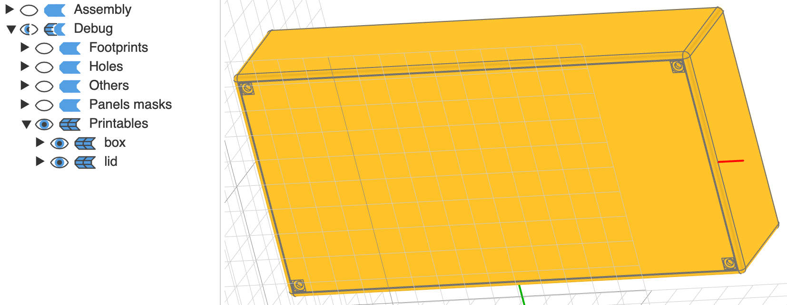
<sub><p align="center">[05_export_enclosure_stls](./examples/05_export_enclosure_stls.py)</p></sub>

<a name="example-06"></a>
### 06 – Enclosure's optional parameters

Shows optional parameters for the `Enclosure` class (see [API Reference](#api-reference-enclosure)). Here, we've updated a few parameters, but the most visibles in the screenshot below is that we've removed the fillet (rounded corners) on the top and bottom of the enclosure.

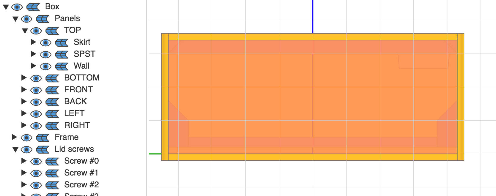
<sub><p align="center">[06_enclosure_optional_params](./examples/06_enclosure_optional_params.py)</p></sub>

<a name="example-07"></a>
### 07 – Layout builder: simple line

Using [LayoutGroup](#api-reference-layout-group) to build a simple line of three components. See optional parameters to center the line on (0,0), add margin between each element, etc.

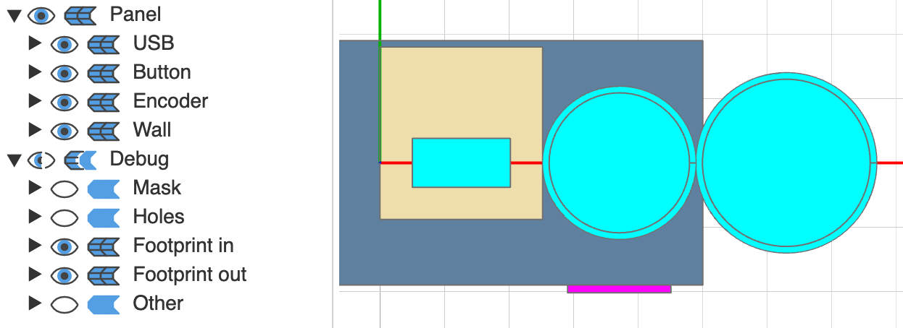
<sub><p align="center">[07_layout_builder_simple_line](./examples/07_layout_builder_simple_line.py)</p></sub>

<a name="example-08"></a>
### 08 – Layout builder: fixed-width line

Line of N components taking all the available space. Here, we're aligning the parts by their 'external footprint': the outwards facing part of the components, such as the hole of a USB, or the knobs of potentiometers.

In the screenshot below, the beige rectangle represents the PCB to which the USB A connector is attached, which is larger than the USB port itself. (Of course, in this example, the board would be sticking out of the enclosure!)

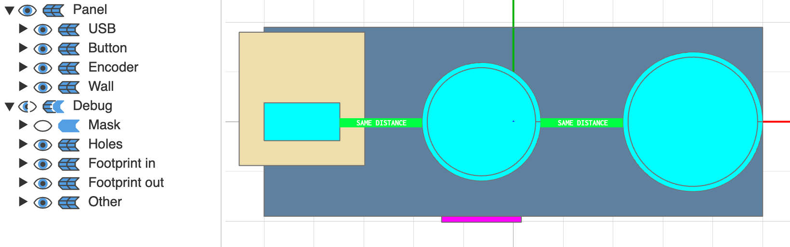
<sub><p align="center">[08_layout_builder_fixed_width_line](./examples/08_layout_builder_fixed_width_line.py)</p></sub>

<a name="example-09"></a>
### 09 – Layout builder: fixed-width line with median part centred at (0,0)

Fixed-width line, but we want to force the median element (here, the second out of three) to be at (0,0). This won't be the case by default if the footprint of the element[s] on its left and the footprint of the element[s] on its right is not equal. (Yes, this means that the elements aren't equally-spaced anymore, but is useful in some cases.)

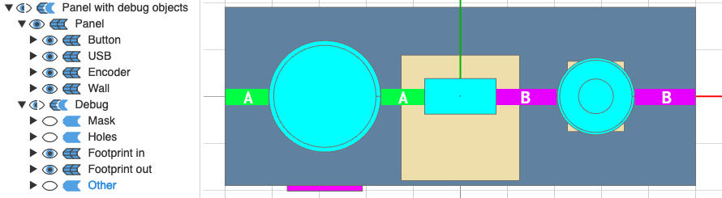
<sub><p align="center">[09_layout_buider_fixed_width_line_centre_at_0_0](./examples/09_layout_buider_fixed_width_line_centre_at_0_0.py)</p></sub>

<a name="example-10"></a>
### 10 – Layout builder: grid of parts

Create a grid of any component (6.35mm jacks in this case). You can define the number of rows and columns, as well as the spacing between them.

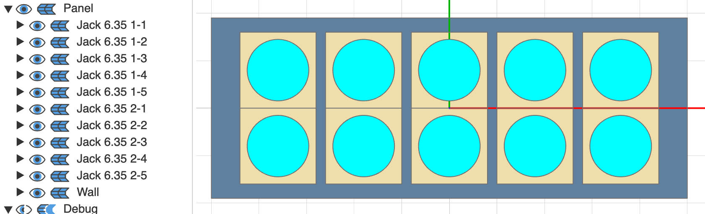
<sub><p align="center">[10_layout_builder_grid_of_parts](./examples/10_layout_builder_grid_of_parts.py)</p></sub>

<a name="example-11"></a>
### 11 – Layout builder: combining groups

[LayoutGroup](#api-reference-layout-group) (and `LayoutElement`) can be combined together: here, we have two grid of jacks (6.35mm and 3.5mm), and a single USB A, equally spread on the panel.

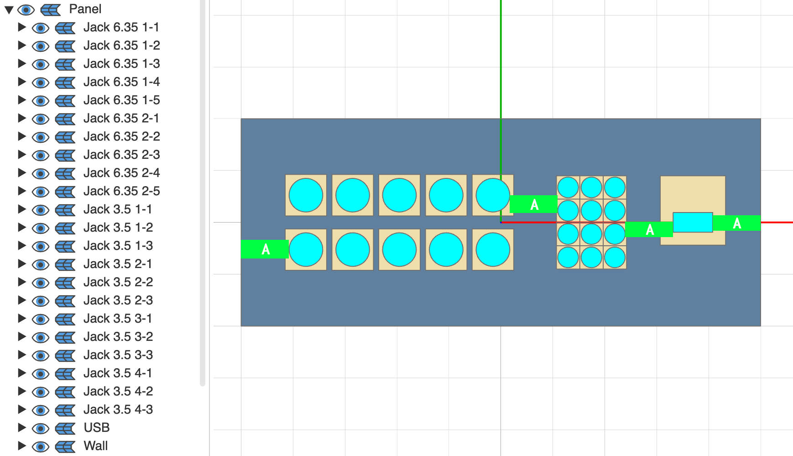
<sub><p align="center">[11_layout_builder_combining_groups](./examples/11_layout_builder_combining_groups.py)</p></sub>

<a name="example-12"></a>
### 12 – Text

You can add extruded and cut text (e.g. for your project's name and version).

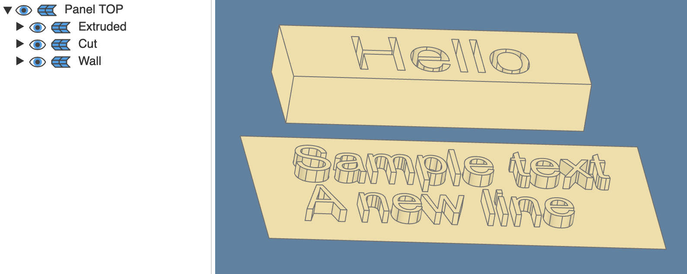
<sub><p align="center">[12_text](./examples/12_text.py)</p></sub>

<a name="example-13"></a>
### 13 – Support for parts

If you have free space under your parts under heavy stress (e.g. the switch on a guitar pedal), you can add a support pillar underneath.

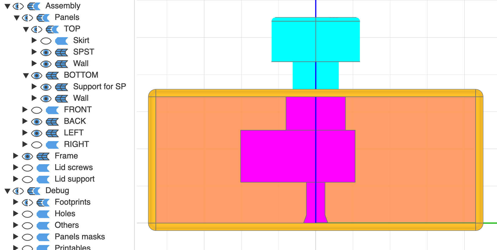
<sub><p align="center">[13_support_for_part](./examples/13_support_for_part.py)</p></sub>

<a name="example-14"></a>
### 14 – Holders for Raspberry Pi and protoboard

Screws to hold your PCBs in place.

For the protobard, the screws can be positioned arbitrarily (grid coordinates).

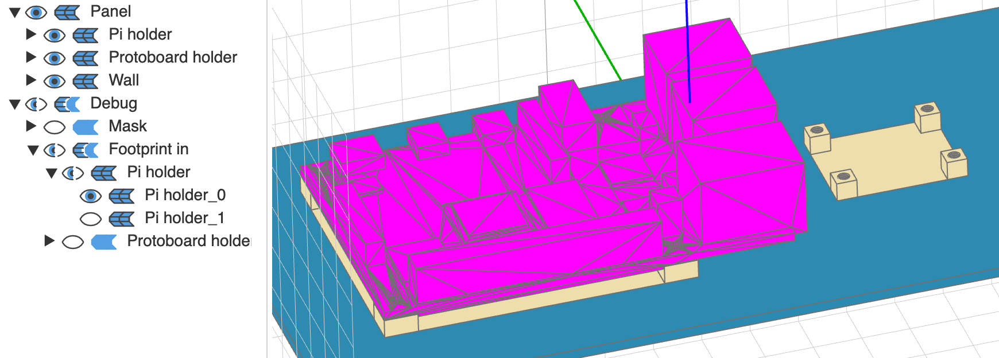
<sub><p align="center">[14_support_for_pi_and_protoboard](./examples/14_support_for_pi_and_protoboard.py)</p></sub>

<a name="example-15"></a>
### 15 – Add a new Part

See **[Adding a new Part](#available-parts-add-new)** for more details.

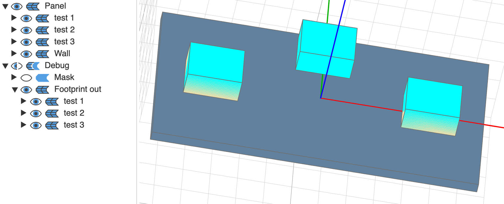
<sub><p align="center">[15_add_new_part](./examples/15_add_new_part.py)</p></sub>

<a name="example-16"></a>
### 16 – All parts

Show all available parts. Note: the default caps/knobs are shown, but there's a dozen available, and more can be added by taking four simple measurements.

For more details, see below.

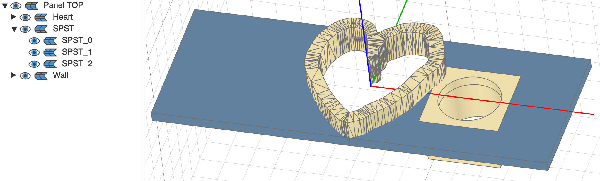
<sub><p align="center">[16_all_parts.py](./examples/16_all_parts.py)</p></sub>

---

<a name="available-parts"></a>
## Available parts

<a name="available-parts-list-builtins"></a>
### Built-in categories and part types

- **jack**: '6.35mm PJ-612A', '3.5mm XXX'
- **button**: 'SPST PBS-24B-4', 'DPDT PBS-24-212SP', 'PBS 11-A', 'PBS-110'
- **encoder**: 'EC11'
- **potentiometer**: 'WH148'
- **usb_a**: '3.0 vertical cltgxdd'
- **usb_c**: 'ChengHaoRan E'
- **screen**: 'HDMI 5 inch JRP5015', 'DSI 5 inch XXX'
- **air_vent**: 'basic rectangular'
- **banana**: '4mm'
- **barrel_plug**: 'DC-022B'
- **rca**: 'N1030'
- **support**: 'pyramid', 'skirt'
- **toggle**: 'MTS-103'
- **midi**: 'SD-50SN'
- **holder**: 'RPi 4B', 'Protoboard'
- **text**: 'default'

<a name="available-parts-add-new"></a>
### Adding a new Part

See [example 15](#example-15) above.

Each part has a category (`button`, `encoder`, `screen`, etc.)

To create a new part, you can copy the file [__template.py](./src/cq_enclosure_builder/parts/__template.py) somewhere in your project. (If you wish to contribute, copy the file into the appropriate sub-folder of [cq_enclosure_builder/parts](./src/cq_enclosure_builder/parts/).)

```
@register_part("<category>", "<part_type>")
```

If contributing, `<category>` should match the sub-folder, otherwise, it can be anything. `<part_type>` represents the reference of your component (e.g. `PBS 11-A`).

If there's no category matching your part, it's not an issue: a new build method `PartsFactory#build_<your new category>` will automatically be added to the factory. (If contributing, simply create a new sub-package in the folder mentioned above.)

You'll now be able to use your part:
```
from cq_enclosure_builder import PartsFactory as pf

my_part = pf.build_<category>(part_type="<part_type>")
```

**Note 1:** set your part as default for this category with `PartsFactory#set_default_types`.

**Note 2:** you don't need to use `@register_part`, it only allows your to use [PartsFactory](./src/cq_enclosure_builder/parts_factory.py) and its built-in cache. If not, simply instantiate your object as you normally would (`MyPart()`).

---

<a name="strength-test"></a>
## Strength test

The enclosures should be strong enough for most enclosure needs, including guitar pedals (which endure stomping!)

I've made to tests using [this PLA](https://www.amazon.de/dp/B09KL2JYT6) (code [here](./examples/strength_test_enclosures.py)):
- the first one was made with nothing supporting the SPST;
- the second one had a small 'pillar' underneath it (see [example 13](#example-13) above), making it very solid with reasonable use. (If you PCB design is flexible, you can plan for a small hole to allow the pillar to support the bottom of the SPST.)


| 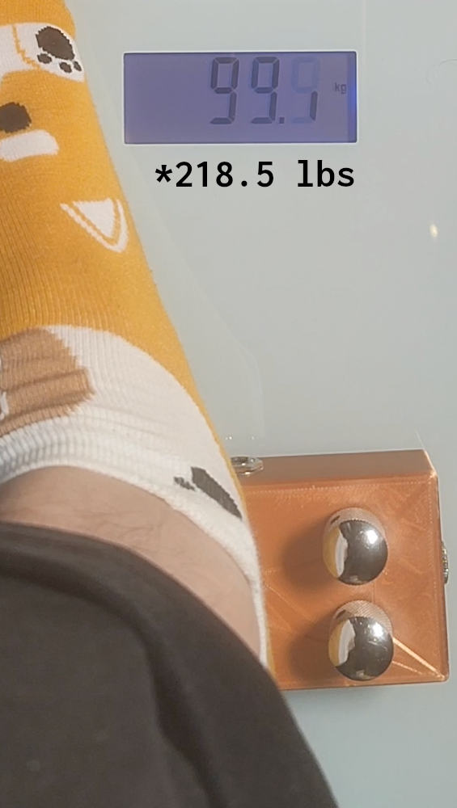 | 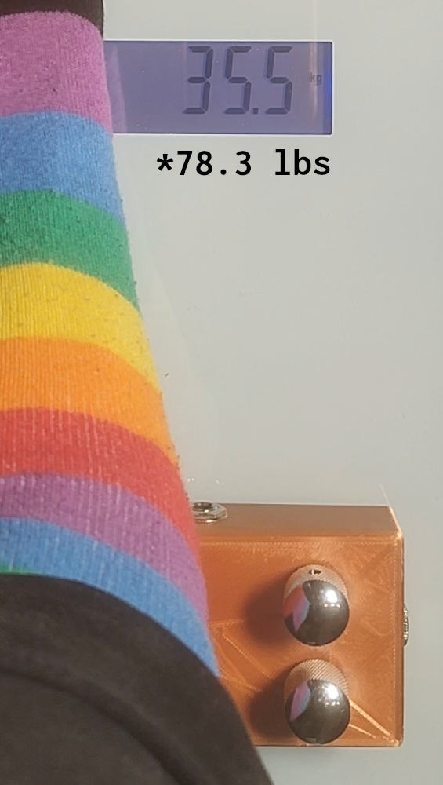 |
|:------------------------------------:|:-------------------------------------:|

---

<a name="api-reference"></a>
## API Reference

<a name="api-reference-enclosure"></a>
### class: [Enclosure](./src/cq_enclosure_builder/enclosure.py)
| Method or Value Name | Parameters | Description |
|-------------|------------|-------------|
| `__init__`  | <ul><li>`size`: [EnclosureSize](./src/cq_enclosure_builder/enclosure.py)</li><li>`project_info`: [ProjectInfo](./src/cq_enclosure_builder/project_info.py) (default: `ProjectInfo()`)</li><li>`lid_on_faces: List[`[Face](./src/cq_enclosure_builder/face.py)`]` (default: `[Face.BOTTOM]`): which side of the enclosure has a screwable lid. Only `BOTTOM` is supported as of now.</li><li>`lid_panel_size_error_margin: float` (default: `0.8`): how small the lid panel is on both width and length compared to the lid hole.</li><li>`lid_thickness_error_margin: float` (default: `0.4`): if >0, the lid screws and support will be slightly sunk in the enclosure.</li><li>`add_corner_lid_screws: bool` (default: `True`)</li><li>`add_lid_support: bool` (default: `True`): add a rim around the enclosure to prevent the lid from sinking in.</li><li>`add_top_support: bool` (default: `True`): small support 'skirt' to increase the strength of the top of the enclosure.</li><li>`lid_screws_heat_set: bool` (default: `True`): use heat-set inserts instead of printing a screw threads for the lid corner screws.</li><li>`no_fillet_top: bool` (default: `False`)</li><li>`no_fillet_bottom: bool` (default: `False`)</li></ul> |  |
| `add_part_to_face` -> `None` | <ul><li>`face: `[Face](./src/cq_enclosure_builder/face.py)</li><li>`part_label: str`: will be shown in the tree when using e.g. [jupyter-cadquery](https://github.com/bernhard-42/jupyter-cadquery).</li><li>`part`: [Part](#api-reference-part)</li><li>`rel_pos: Tuple[float, float]` (default: `None`; one of `rel_pos`/`abs_pos` needs to be set): position relative to the centre of the [Panel](#api-reference-panel).</li><li>`abs_pos: Tuple[float, float]` (default: `None`; needs one): position from one corner of the [Panel](#api-reference-panel).</li><li>`color: cq.Color` (default: `None`; defaults to [Panel](#api-reference-panel)'s default)</li></ul> | |
| `assemble` -> `None` | <ul><li>`walls_explosion_factor: float` (default: `1.0`): a value >1 will move the enclosure's walls aways, giving a better inside view.</li><li>`lid_panel_shift: float` (default: `0.0`): move the lid panel (`BOTTOM`) away from the enclosure. | Needs to be called before calling `export_printables` or using the `assembly`. |
| `export_printables` -> `None` | *none* | Export one STL per printable. By default, one for the `lid` and for the `box`. Some parts can require additional prints; any element added to [Part](#api-reference-part)'s `additional_printables` will also be exported.</li></ul>  |
| `add_corner_lid_screws` -> `None` | *see code* | Called by the constructor if `add_corner_lid_screws` is `True`. |
| `add_screw` -> `None` | *see code* | If you want to add more screws than the four corner screw than can be added automatically. |
| (value) `assembly`: `cq.Assembly` | *N/A* | Contains a displayable assembly with the panels (incl. parts), frame, lid screws, and lid support.
| (value) `debug`: `cq.Assembly` | *N/A* | Debug elements: footprints, holes, panels masks, printables, and other debug elements added by the parts ([Part](#api-reference-part)'s `debug_objects`).
| (value) `assembly_with_debug`: `cq.Assembly` | *N/A* | Assembly containing the two previous assemblies.

---

<a name="api-reference-parts-factory"></a>
### class: [PartsFactory](./src/cq_enclosure_builder/parts_factory.py)
| Method Name | Parameters | Description |
|-------------|------------|-------------|
| `build` -> [Part](./src/cq_enclosure_builder/part.py)  | <ul><li>`category_name: str`</li><li>`part_type: str` (default: any default value for this `category` set with `set_default_types`).</li><li>`throw_on_validation_error: bool` (default: `True`): useful when adding new parts to make sure nothing's missing.</li><li>`**kwargs: Any`: any parameter needed by the part you're building.</li></ul> | |
| `build_<category_name>` -> [Part](./src/cq_enclosure_builder/part.py) | *same as above (excluding `category_name`)* | Dynamically generated for each new category registered with `@register_part`. |
| `list_categories` -> `List[str]`  | *N/A* | List all the categories registered in the factory, e.g. `["encoder", "midi", ...]` |
| `list_types_for_category` -> `List[str]`  | <ul><li>`category_name: str`</li></ul> | List all the types available for a given category (for instance, various types of USB C connectors). |
| `list_types_of_<category_name>` -> `List[str]`  | *N/A* | Same as above, without needing to provide `category_name` as parameter.  Dynamically generated. |
| `set_default_types` -> `None`  | <ul><li>`defaults: Dict[str, str]`: the default part type to use per category; for example: `{"<samecategory_name>": '<a type from that category>}`.</li></ul> | Set the default part for any category, so you don't have to repeat `part_type="<type>"` each time you're building a part. |
| `set_default_parameters` -> `None`  | <ul><li>`defaults: Dict[str, Any]`: the default values to use when encountering field with this name when building a part; for example: `{"<param_name>": 123.45}`.</li></ul> | For instance, if setting a default value for `enclosure_wall_thickness`, it won't have to be repeated explicitly each time you're building a part. Can be overridden. |
| `set_defaults` -> `None`  | <ul><li>`defaults: Dict[str, Dict])`: should contains two keys, `types` and `parameters`.</li></ul> | Sets both `set_default_types` and `set_default_parameters` at once. |

---

<a name="api-reference-layout-element"></a>
### class: [LayoutElement](./src/cq_enclosure_builder/layout_builder/layout_elementgroup.py)

| Method Name | Parameters | Description |
|-------------|------------|-------------|
| `__init__`  | <ul><li>`label: str`</li><li>`part`: [Part](#api-reference-part)</li></ul> |  |
| `move_to` -> `Self`  | <ul><li>`pos: Tuple[float, float]`</li></ul> |  |
| `translate` -> `Self`  | <ul><li>`pos: Tuple[float, float]`</li></ul> |  |
| `get_pos` -> `Tuple[float, float]`  | *none* | Get the relative pos (centre is 0,0). |
| `get_abs_pos` -> `Tuple[float, float]` | <ul><li>`panel`: [Panel](#api-reference-panel)</li></ul> | Get the absolute based on the size of the panel. |
| `set_inside_footprint_x` -> `None` | <ul><li>`new_x: float`</li></ul> | Overrides the real footprint of the element. See [example 9](#example-09) for use case. |
| `set_outside_footprint_x` -> `None`  | <ul><li>`new_x: float`</li></ul> | *see above* |
| `set_footprints_x` -> `None`  | <ul><li>`new_x: float`</li></ul> | *see above*<br/><br/>Set both inside and outside at once. |
| `set_inside_footprint_y` -> `None`  | <ul><li>`new_y: float`</li></ul> | Overrides the real footprint of the element. See [example 9](#example-09) for use case. |
| `set_outside_footprint_y` -> `None`  | <ul><li>`new_y: float`</li></ul> | *see above* |
| `set_footprints_y` -> `None`  | <ul><li>`new_y: float`</li></ul> | *see above*<br/><br/>Set both inside and outside at once. |

---

<a name="api-reference-layout-group"></a>
### class: [LayoutGroup](./src/cq_enclosure_builder/layout_builder/layout_group.py) (layout builder), inherits [LayoutElement](./src/cq_enclosure_builder/layout_builder/layout_element.py)

| Method Name | Parameters | Description |
|-------------|------------|-------------|
| `__init__`  | *not needed* | ZZZ |
| `move_to` -> `Self`  | <ul><li>`pos: Tuple[float, float]`</li></ul> | Same as [LayoutElement](#api-reference-layout-element). Set the pos of the entire group. |
| `translate` -> `Self`  | <ul><li>`pos: Tuple[float, float]`</li></ul> | Same as [LayoutElement](#api-reference-layout-element). Translate all the elements of the group. |
| `get_pos` -> `Tuple[float, float]` | *none* | Get the relative pos (centre is 0,0). |
| `get_elements` -> `List[`[LayoutElement](#api-reference-layout-element)`]`  | *none* | Returns all the elements of the group. If there's nested groups, it flatten them by recurisvely calling `get_elements`. |
| (static) `line_of_parts` -> `LayoutGroup`  | <ul><li>`parts: Union[`[Part](#api-reference-part)`, Tuple[str, `[Part](#api-reference-part)`]]`: either a list of parts or a list of tuple containing a label for the part and part itself</li>`margin: float` (default: `5`): the distance between each element.</li><li>`horizontal: bool` (default: `True`)</li><li>`group_center_at_0_0: bool` (default: `True`): if `False`, the line will start at position 0; if `True`, the line will be `translate` by `-(line width/2)` so its centre is at 0.</li><li>`elements_centers_at_0_0: bool` (default: `True`): if `True`, each element will be `translate` by `total_footprint_offset` (if `horizontal`, it will only translate the Y position; and vice versa).</li><li>`align_start_to_outside_footprint: bool` (default: `False`): if `True`, the outside footprint of the first element will be at position 0 (only matters if the inside footprint is larger than the outside); if `False`, it will use total footprint (whichever is largest).</li><li>`align_to_outside_footprint: bool` (default: `False`): if `True`, the outside footprint of the first item will be at 0 (only matters if the inside footprint is larger than the outside); if `False`, it will use total footprint (whichever is largest).</li></ul> | Return a simple group where each part is next to each other in a line. |
| (static) `line_of_elements` -> `LayoutGroup`  | <ul><li>`elements: List[LayoutElement]`</li></ul>Rest is identical to `line_of_parts`. | The `element` variant is useful to combine groups. |
| (static) `fixed_width_line_of_parts` -> `LayoutGroup`  | <ul><li>`size: float`: the maximum space taken by the line.</li><li>`parts: Union[`[Part](#api-reference-part)`, Tuple[str, `[Part](#api-reference-part)`]]`: either a list of parts or a list of tuple containing a label for the part and part itself.</li><li>`horizontal: bool` (default: `True`)</li><li>`add_margin_on_sides: bool` (default `True`): if `False`, the first and last elements will be touching the start and end of the line; if True, the same margin found between each element will also be at the start and end.</li><li>`group_center_at_0_0: bool` (default: `True`): *see `line_of_parts`.*</li><li>`elements_centers_at_0_0: bool` (default: `True`): *see `line_of_parts`.*</li><li>`align_to_outside_footprint: bool` (default: `False`): *see `line_of_parts`.*</li></ul> | Return a line of element spaced equally, taking a set amount of space. |
| (static) `fixed_width_line_of_elements` -> `LayoutGroup`  | <ul><li>`elements: List[LayoutElement]`</li></ul>Rest is identical to `fixed_width_line_of_parts` (same order). | The `element` variant is useful to combine groups. |
| (static) `grid_of_part` -> `LayoutGroup`  | <ul><li>`label: str`</li><li>`part`: [Part](#api-reference-part)</li><li>`rows: int`: number of rows.</li><li>`cols: int`: number of columns.</li><li>`margin_rows: float` (default: `5`): margin between each row.</li><li>`margin_cols: float` (default: `5`): margin between each col.</ul> | Return a grid of `rows` x `cols` made up the same [Part](#api-reference-part). |

---

<a name="api-reference-panel"></a>
### class: [Panel](./src/cq_enclosure_builder/panel.py)

| Method Name | Parameters | Description |
|-------------|------------|-------------|
| `__init__`  | <ul><li>`face`: [Face](./src/cq_enclosure_builder/face.py): the panel's face, used to determine its orientation</li><li>`size: PanelSize`: the panel's width, length, and wall thickness</li><li>`color: Tuple[float, float, float]` (default: `None`; use the [Face](./src/cq_enclosure_builder/face.py)'s default): the colour of the panel's wall</li><li>`part_color: Tuple[float, float, float]` (default: `None`; use the [Face](./src/cq_enclosure_builder/face.py)'s default): the colour of the panel's parts</li><li>`alpha: float` (default: `1.0`): the panel wall's transparency (doesn't affect its parts)</li><li>`lid_size_error_margin: float` (default: `0.0`): used only for the lid panel; if provided, the actual size of the panel will be smaller than the `size` param (will the `mask` will be the provided size)</li><li>`project_info`: [ProjectInfo](./src/cq_enclosure_builder/project_info.py) (default: `ProjectInfo()`): here, mainly used for logging |  |
| `add` -> `None` | <ul><li>`label: str`: the part's name</li><li>`part`: [Part](#api-reference-part`)</li><li>`rel_pos: Tuple[float, float]` (default: `None`; one of `rel_pos`/`abs_pos` needs to be set): position relative to the centre of the panel.</li><li>`abs_pos: Tuple[float, float]` (default: `None`; needs one): position from one corner of the panel.</li><li>`color: Tuple[float, float, float]` (default: `None`; will use the default of the panel's [Face](./src/cq_enclosure_builder/face.py))</li><li>`alpha: float` (default: `1.0`)</li></ul> |  |
| `assemble` -> `None`  | *none* | Should be called before using the values below. |
| (value) `panel`: `cq.Workplane`  | *N/A* | The panel 'wall' and all its parts  |
| (value) `mask`: `cq.Workplane`  | *N/A* | A solid box of the size `(size.width, size.length, size.wall_thickness)` |
| (value) `debug_assemblies`: `Dict[str, Union[Dict, cq.Workplane]]`  | *N/A* | Assemblies: `footprint_in`, `footprint_out`, `hole`, `other` (from the `debug_objects` field of the panel's part), `combined` |

---

<a name="api-reference-part"></a>
### class: [Part](./src/cq_enclosure_builder/part.py)

| Method Name | Parameters | Description |
|-------------|------------|-------------|
| `__init__`  | *none* | No-arg constructors, sets the variables below to their default values. |
| (value) `part`: `cq.Workplane` | *N/A* | The part that will be added to the panel. |
| (value) `assembly_parts`: `List[AssemblyPart]` (default: `None`) | `AssemblyPart` has fields `workplane: cq.Workplane`, `name: str`, and `color: cq.Color`. Used to keep sub-parts visually separated (e.g. having screws colored differently); will be used for display if present, otherwise `part` will be. `part` should still be set if equivalent; see comment in [Part](./src/cq_enclosure_builder/part.py) |
| (value) `mask`: `cq.Workplane` | *N/A* | Will be cut from the panel, should likely be the same width/length as the `part`. |
| (value) `size`: `PartSize` | *N/A* | `PartSize` has fields `width: float`, `length: float`, and `thickness: float`. |
| (value) `additional_printables: Dict[str, cq.Workplane]` | *N/A* | Workplanes in this map will be export when calling [Enclosure](#api-reference-enclosure)'s `export_printables'. | 
| (value) `inside_footprint: Tuple[float, float]` | *N/A* | Needed by the layout builder ([LayoutGroup](#api-reference-layout-group)) to position elements. |
| (value) `inside_footprint_thickness: float` | *N/A* | Currently, only used when wanting to create a "pyramid" support to sit underneath another part, for added strength. |
| (value) `inside_footprint_offset: Tuple[float, float]` | *N/A* | How far the centre-point of the inside_footprint is from (0,0). Used by the layout builder. |
| (value) `outside_footprint: Tuple[float, float]` | *N/A* | Needed by the layout builder ([LayoutGroup](#api-reference-layout-group)) to position elements. |
| (value) `outside_footprint_thickness: float` | *N/A* | Unused at the moment; recommend to fill it when creating new parts. |
| (value) `outside_footprint_offset: Tuple[float, float]` (default: `(0,0)`) | *N/A* | How far the centre-point of the outside_footprint is from (0,0). Currently, it assumes `(0,0)`: any other value will be ignored. If it's not the case for your part (e.g. the centre of your USB connector's hole not exactly at `(0,0)`), the layout builder won't work perfectly. |
| (value) `debug_objects`: [DebugObjects](#api-reference-debug-objects) | *N/A* | Used to get useful visual information on your part. For instance, it will show how much a SPST is sticking out of an enclosure (including caps). |

<a name="api-reference-debug-objects"></a>
### class: [DebugObjects](./src/cq_enclosure_builder/part.py)

| Value Name | Parameters | Description |
|-------------|------------|-------------|
| `__init__`  | *none* |  |
| (value) `footprint`: `DebugObjects.Footprint` | *N/A* | Sub-classes has two fields, `inside: cq.Workplane` and `outside: cq.Workplane` (default for both: `None`). It is used to show the actual space taken by the part. If you're creating a new part, you likely want to set these fields if relevant. |
| (value) `hole`: `cq.Workplane` (default: `None`) | *N/A* | Visual representation of the hole in the enclosure (e.g. for a USB port, it will simply be the size of the connector). |
| (value) `others`: `Dict[str, cq.Workplane]` | *N.A* | Shown in the [Panel](#api-reference-panel)'s and [Enclosure](#api-reference-enclosure)'s debug assemblies.

---

If there's any problem, feel free to open a PR, or create an issue; thanks!