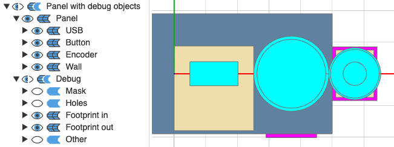

# cq_enclosure_builder
Easily generate printable enclosures for your projects in just a few lines of code.

### Features
- **Parts library**: includes jacks, barrel plugs, USBs, and more (22 parts across 16 categories so far—see [List of built-in parts](#available-parts-list-builtins)).
    - Easy to extend with your own parts (e.g. the specific model of SPST you're using).
    - Create custom parts from **existing STEP files** (converted from **STL** if necessary).
- **Screwable lid**: supports heat set inserts and regular printed threads.
- **Layout builder**: offers parametric lines and grids of parts.
- **STL export**: generates ready-to-print files.

| <br><sub>Code to generate the model</sub> | <br><sub>Model preview</sub> | <br><sub>TODO IMAGE Printed result</sub> |
|:--------------------------:|:---------------------------:|:----------:|

---

## Summary
- **[Install](#install)**
- **[Examples (with screenshots)](#examples)**
    - **[01 – Panel with buttons](#example-01)**
    - **[02 – Set default part types and parameters](#example-02)**
    - **[03 – Panel's optional parameters](#example-03)**
    - **[04 – Enclosure with buttons](#example-04)**
    - **[05 – Enclosure: export STLs](#example-05)**
    - **[06 – Enclosure: optional parameters](#example-06)**
    - **[06.5 – Enclosure: custom screws placement](#example-06_5)**
    - **[07 – Layout builder: simple line](#example-07)**
    - **[08 – Layout builder: fixed-width line](#example-08)**
    - **[09 – Layout builder: fixed-width line with median part centred at 0,0](#example-09)**
    - **[10 – Layout builder: grid of parts](#example-10)**
    - **[11 – Layout builder: combining groups](#example-11)**
    - **[12 – Text (cut and extruded)](#example-12)**
    - **[13 – Support for parts](#example-13)**
    - **[14 – Holders for Raspberry Pi and protoboard](#example-14)**
    - **[15 – Add a new Part](#example-15)**
    - **[16 – Add a new Part from a STL/STEP file](#example-17)**
    - **[17 – All parts](#example-16)**
- **[Available parts](#available-parts)**
    - **[List of built-in parts](#available-parts-list-builtins)**
    - **[Adding a new Part](#available-parts-add-new)**
    - **[Adding a new Part from a STL or STEP file](#available-parts-add-new-step)**
- **[Strength Test](#strength-test)**
    - **[With support](#strength-test)**
    - **[Without support](#strength-test)**
- **[API Reference](#api-reference)**
    - **[Enclosure](#api-reference-enclosure)**
    - **[PartsFactory](#api-reference-parts-factory)**
    - **[LayoutElement](#api-reference-layout-element)**
    - **[LayoutGroup](#api-reference-layout-group)** (layout builder)
    - **[Panel](#api-reference-panel)**
    - **[Part](#api-reference-part)**

---

<a name="install"></a>
## Install

<a name="install-quick"></a>
### Quick install

```shell
$ python setup.py install
```

**Note**: if you already have the required dependencies (see [Manual install](#install-manual)), this is not required to run the examples.

This will install `cq_enclosure_builder` on your system, as well as the required libraries (<a href="https://cadquery.readthedocs.io/en/latest/installation.html" target="_blank">CadQuery</a> and <a href="https://github.com/gumyr/cq_warehouse" target="_blank">cq_warehouse</a>.).

You'll also need to copy a file to your <a href="https://github.com/gumyr/cq_warehouse" target="_blank">cq_warehouse</a> install folder, as this project uses a custom type of screw. See `flat_head_parameters.csv` in the section below. (In future versions, the default type of screw used will be change, to reduce complexity; see issue [#5](https://github.com/raphael-isvelin/cq_enclosure_builder/issues/5).)

<a name="install-manual"></a>
### Manual install

First, you'll need to install <a href="https://cadquery.readthedocs.io/en/latest/installation.html" target="_blank">CadQuery</a>.

Then, install the library used to generate screws: <a href="https://github.com/gumyr/cq_warehouse" target="_blank">cq_warehouse</a>.

Finally, copy the custom screw used by the project in <a href="https://github.com/gumyr/cq_warehouse" target="_blank">cq_warehouse</a>'s install folder:'

```shell
# Or wherever your cq_warehouse install folder is
$ cp src/cq_enclosure_builder/screws/flat_head_parameters.csv ~/miniconda3/lib/python3.10/site-packages/cq_warehouse/flat_head_parameters.csv
```

### UI

There are a few available UIs you can choose from, including:
- <a href="https://github.com/bernhard-42/jupyter-cadquery#installation" target="_blank">jupyter-cadquery</a>: more features and flexibility, but requires a working <a href="https://jupyter.org/install" target="_blank">Jupyter Notebook/Lab</a> (highly recommended if you decide to design your own parts).
- <a href="https://github.com/CadQuery/CQ-editor#installation---pre-built-packages-recommended" target="_blank">cq-editor</a>: the default UI.

To run the examples, just open them with the UI you've picked, and they should work right away. **If I missed a required dependency, please let me know!**

<a name="examples"></a>
## Examples (with screenshots)

You can explore the provided examples. If you're using <a href="https://github.com/bernhard-42/jupyter-cadquery#installation" target="_blank">jupyter-cadquery</a>, check out [00_all_examples.ipynb](./examples/00_all_examples.ipynb) which groups all examples into a single Notebook.

For other UIs, navigate to the [examples](./examples/) directory and open the individual `.py` files with your chosen UI.

### 01 – Panel with buttons

A single [Panel](#api-reference-panel) (side of an enclosure) with two buttons.


<sub><p align="center">[01_panel_with_button.py](./examples/01_panel_with_button.py)</p></sub>

<a name="example-02"></a>
### 02 – Set default part types and parameters

Almost the same as above, but shows how [PartsFactory](#api-reference-parts-factory)'s `set_default_types` and `set_default_parameters` can help you make your code more readable, by removing the need to repeat the `part_type` (e.g. with specific model of SPST you're using for your project), and removing the need to repeat common parameters such as `enclosure_wall_thickness`.


<sub><p align="center">[02_default_part_type_and_parameters.py](./examples/02_default_part_type_and_parameters.py)</p></sub>

<a name="example-03"></a>
### 03 – Panel's optional parameters

Shows optional parameters for the [Panel](#api-reference-panel) class (see [API Reference](#api-reference-panel)). Here, we've updated the panel colour, the part colour, and the panel's transparency.


<sub><p align="center">[03_panel_optional_params.py](./examples/03_panel_optional_params.py)</p></sub>

<a name="example-04"></a>
### 04 – Enclosure with buttons

A simple [Enclosure](#api-reference-enclosure) with an 'exploded' view.


<sub><p align="center">[04_enclosure_with_button.py](./examples/04_enclosure_with_button.py)</p></sub>

<a name="example-05"></a>
### 05 – Enclosure: export STLs

[Enclosure](#api-reference-enclosure)'s `export_printables` will generate ready-to-print STLs files for each distinct part of your project. Most enclosures will typically require only to parts to print: the main section (**box**) and a **lid**, while others will require additional prints (such as brackets to hold a specific type of screen in this example).


<sub><p align="center">[05_export_enclosure_stls.py](./examples/05_export_enclosure_stls.py)</p></sub>

<a name="example-06"></a>
### 06 – Enclosure: optional parameters

Shows optional parameters for the [Enclosure](#api-reference-enclosure) class. Here, we've updated a few parameters, but the most visibles in the screenshot below is that we've removed the fillet (rounded corners) on the top and bottom of the enclosure.

We've also changed the project's name, which generated printables STLs with a customisd name.


<sub><p align="center">[06_enclosure_optional_params.py](./examples/06_enclosure_optional_params.py)</p></sub>

<a name="example-06_5"></a>
### 06.5 – Enclosure: custom screws placement

Certainly! Here's a revised version of your description:

By default, the [Enclosure](#api-reference-enclosure) includes four screws at its corners. However, you can customize this setup. In the following example, we added two M2 screws with printed threads, complementing the default four M3 heat set inserts.


<sub><p align="center">[06_5_enclosure_custom_screws.py](./examples/06_5_enclosure_custom_screws.py)</p></sub>

<a name="example-07"></a>
### 07 – Layout builder: simple line

Using [LayoutGroup](#api-reference-layout-group) to build a simple line of three components. See optional parameters to center the line on (0,0), add margin between each element, etc.


<sub><p align="center">[07_layout_builder_simple_line.py](./examples/07_layout_builder_simple_line.py)</p></sub>

<a name="example-08"></a>
### 08 – Layout builder: fixed-width line

Line of N components taking all the available space. Here, we're aligning the parts by their 'external footprint': the outward-facing section of the components, such as the hole of a USB or the knobs of potentiometers.

In the screenshot below, the beige rectangle represents the PCB onto which the USB A connector is mounted, which is larger than the USB port itself. Conversely, for the button and encoder, the cap and knob are more prominent than their respective base components.


<sub><p align="center">[08_layout_builder_fixed_width_line.py](./examples/08_layout_builder_fixed_width_line.py)</p></sub>

<a name="example-09"></a>
### 09 – Layout builder: fixed-width line with median part centred at (0,0)

In this fixed-width line layout, we aim to position the median element (in this instance, the second out of three) directly at the coordinate `(0,0)`. By default, this positioning might not be achieved if the footprint of the element(s) to its left differs from that of the element(s) to its right. Though will make the spacing slightly uneven, it's useful when we want to force an element at (0,0).


<sub><p align="center">[09_layout_buider_fixed_width_line_centre_at_0_0.py](./examples/09_layout_buider_fixed_width_line_centre_at_0_0.py)</p></sub>

<a name="example-10"></a>
### 10 – Layout builder: grid of parts

Create a grid of any component (6.35mm jacks in this case). You can define the number of rows and columns, as well as the spacing between them.


<sub><p align="center">[10_layout_builder_grid_of_parts.py](./examples/10_layout_builder_grid_of_parts.py)</p></sub>

<a name="example-11"></a>
### 11 – Layout builder: combining groups

You can combine multiple [LayoutGroup](#api-reference-layout-group) (and [LayoutElement](#api-reference-layout-element]) instances. In this example, we've evenly spaced two grids of jacks (6.35mm and 3.5mm) along with a single USB A on the panel.


<sub><p align="center">[11_layout_builder_combining_groups.py](./examples/11_layout_builder_combining_groups.py)</p></sub>

<a name="example-12"></a>
### 12 – Text (cut and extruded)

You can add extruded and cut text (e.g. for your project's name and version).


<sub><p align="center">[12_text.py](./examples/12_text.py)</p></sub>

<a name="example-13"></a>
### 13 – Support for parts

For parts under heavy stress, such as the switch on a guitar pedal, you can add a support pillar underneath if there's available space.


<sub><p align="center">[13_support_for_part.py](./examples/13_support_for_part.py)</p></sub>

<a name="example-14"></a>
### 14 – Holders for Raspberry Pi and protoboard

Screws to hold your PCBs in place.

For the protobard, the screws can be positioned arbitrarily (grid coordinates).


<sub><p align="center">[14_holders_for_pi_and_protoboard.py](./examples/14_holders_for_pi_and_protoboard.py)</p></sub>

<a name="example-15"></a>
### 15 – Add a new Part

See [Adding a new Part](#available-parts-add-new) for more details.


<sub><p align="center">[15_add_new_part.py](./examples/15_add_new_part.py)</p></sub>

<a name="example-16"></a>
### 16 – Add a new Part from a STL/STEP file

In this example, I've made a model using Tinkercad, which I exported as a STL. Fusion 360 then allowed me to convert it to STEP. (You can also use online converters, though I've had some format issues with these.)

After creating a new [Part](#api-reference-part) and filling a few fields (size, etc.), you'll be able to add it to your enclosure.


<sub><p align="center">[16_add_new_part_from_step.py](./examples/16_add_new_part_from_step.py)</p></sub>

<a name="example-17"></a>
### 17 – All parts

Show all available parts.

For a detailed list, scroll down to [List of built-in parts](#available-parts-list-builtins).

**Note:** the default caps/knobs are shown, but there's a dozen available, and more can be added by taking four simple measurements.


<sub><p align="center">[17_all_parts.py](./examples/17_all_parts.py)</p></sub>

---

<a name="available-parts"></a>
## Available parts

<a name="available-parts-list-builtins"></a>
### List of built-in parts

For many parts, I've provided purchase links within the docstrings of the Python code, so you can obtain the exact item I used for modeling them.

- **jack**: [6.35mm PJ-612A](./src/cq_enclosure_builder/parts/jack/jack_6_35mm_pj612a.py), [3.5mm PJ-392](./src/cq_enclosure_builder/parts/jack/jack_3_5mm_pj392.py)
- **button**: [SPST PBS-24B-4](./src/cq_enclosure_builder/parts/button/spst_pbs_24b_4.py), [DPDT PBS-24-212SP](./src/cq_enclosure_builder/parts//button/dpdt_pbs_24_212sp.py), [PBS 11-A](./src/cq_enclosure_builder/parts/button/button_pbs_11a.py), [PBS-110](./src/cq_enclosure_builder/parts/button/button_pbs_110.py)
- **encoder**: [EC11](./src/cq_enclosure_builder/parts/encoder/encoder_ec11.py)
- **potentiometer**: [WH148](./src/cq_enclosure_builder/parts/potentiometer/potentiometer_wh148.py)
- **usb_a**: [3.0 cltgxdd](./src/cq_enclosure_builder/parts/usb_a/usb_a_30_vertical_cltgxdd.py)
- **usb_c**: [ChengHaoRan E](./src/cq_enclosure_builder/parts/usb_c/usb_c_chenghaoran_e.py)
- **screen**: [HDMI 5 inch JRP5015](./src/cq_enclosure_builder/parts/screen/hdmi_5inch_jrp5015.py), [DSI 5 inch CFsunbird](./src/cq_enclosure_builder/parts/screen/dsi_5inch_CFsunbird.py)
- **air_vent**: [basic rectangular](./src/cq_enclosure_builder/parts/air_vent/rect_air_vent_part.py)
- **banana**: [4mm](./src/cq_enclosure_builder/parts/banana/banana_4mm.py)
- **barrel_plug**: [DC-022B](./src/cq_enclosure_builder/parts/barrel_plug/barrel_plug_dc022b.py)
- **rca**: [N1030](./src/cq_enclosure_builder/parts/rca/rca_n1030.py)
- **support**: [pyramid](./src/cq_enclosure_builder/parts/support/pyramid_support.py), [skirt](./src/cq_enclosure_builder/parts/support/skirt.py)
- **toggle**: [MTS-103](./src/cq_enclosure_builder/parts/toggle/toggle_mts103.py)
- **midi**: [SD-50SN](./src/cq_enclosure_builder/parts/midi/midi_sd_50sn.py)
- **holder**: [RPi 4B](./src/cq_enclosure_builder/parts/holder/pi4_holder.py), [Protoboard](./src/cq_enclosure_builder/parts/holder/protoboard_holder.py)
- **text**: [default](./src/cq_enclosure_builder/parts/text//default_text.py)

<a name="available-parts-add-new"></a>
### Adding a new Part

See [example 15](#example-15) above.

Each part belongs to a category, such as `button`, `encoder`, `screen`, and so forth. (New categories can be added on the fly.)

#### Steps

1. Copy the file [__template.py](./src/cq_enclosure_builder/parts/__template.py) to a location in your project.
    - **For contributors**: place the file into the appropriate sub-package of [cq_enclosure_builder/parts](./src/cq_enclosure_builder/parts/).
2. *(Optional)* Use the `@register_part("<category>", "<part_type>")` decorator.
    - `<category>` should match the sub-folder if contributing. Otherwise, it can be any valid Python identifier.
    - `<part_type>` represents the reference for your component (e.g. `PBS 11-A`).
3. If your part's category doesn't exist, no problem! A new build method—`build_<your new category>`—will be automatically added to the [PartsFactory](#api-reference-parts-factory).
    - **For contributors**: simply create a new sub-package in the previously mentioned folder.
4. You'll now be able to use your part as follows:
```python
from cq_enclosure_builder import PartsFactory as pf

my_part = pf.build_<category>(part_type="<part_type>")
```

**Note 1:** set your part as default for this category with [PartsFactory](#api-reference-parts-factory)'s `set_default_types`.

**Note 2:** the `@register_part` decorator is optional but allows for integration with [PartsFactory](#api-reference-parts-factory) and its built-in caching. Without it, instantiate your object as usual, like `MyPart()`.

<a name="available-parts-add-new-step"></a>
### Adding a new Part from a STL or STEP file

CadQuery only supports <a href="https://cadquery.readthedocs.io/en/latest/importexport.html" target="_blank">importing STEP files</a>. If you're working with an STL, you can easily convert them to STEP using <a href="https://www.autodesk.com/products/fusion-360/personal" target="_blank">Fusion 360</a>, or online converters (though I've had some format issues with these).

Once you have a STEP file, follow the steps (ah!) shown in [example 16](#example-16).

---

<a name="strength-test"></a>
## Strength test

The enclosures should be strong enough for most needs, including guitar pedals (which experience regular stomping!)

I conducted two tests using <a href="https://www.amazon.de/dp/B09KL2JYT6" target="_blank">this PLA</a>:
- in the first test, the enclosure was constructed without any support beneath the SPST;
- for the second test, a small 'pillar' was added underneath the SPST (see [example 13](#example-13) above), making it very solid (if you don't plan to stand on top of it).

The code used to generate the STLs for these tests can be found [here](./examples/strength_test_enclosures.py).

|  |  |
|:------------------------------------:|:-------------------------------------:|

---

<a name="api-reference"></a>
## API Reference

<a name="api-reference-enclosure"></a>
### class: [Enclosure](./src/cq_enclosure_builder/enclosure.py)
| Method or Value Name | Parameters | Description |
|-------------|------------|-------------|
| `__init__`  | <ul><li>`size`: [EnclosureSize](./src/cq_enclosure_builder/enclosure.py)</li><li>`project_info`: [ProjectInfo](./src/cq_enclosure_builder/project_info.py) (default: `ProjectInfo()`): name and version are used for naming the exported STLs.</li><li>`lid_on_faces: List[`[Face](./src/cq_enclosure_builder/face.py)`]` (default: `[Face.BOTTOM]`): which side of the enclosure has a screwable lid. Only `BOTTOM` is supported as of now; see issues [#2](https://github.com/raphael-isvelin/cq_enclosure_builder/issues/2) and [#3](https://github.com/raphael-isvelin/cq_enclosure_builder/issues/3).</li><li>`lid_panel_size_error_margin: float` (default: `0.8`): how small the lid panel is on both width and length compared to the lid hole.</li><li>`lid_thickness_error_margin: float` (default: `0.4`): if >0, the lid screws and support will be slightly sunk in the enclosure.</li><li>`add_corner_lid_screws: bool` (default: `True`)</li><li>`add_lid_support: bool` (default: `True`): add a rim around the enclosure to prevent the lid from sinking in.</li><li>`add_top_support: bool` (default: `True`): small support 'skirt' to increase the strength of the top of the enclosure.</li><li>`lid_screws_heat_set: bool` (default: `True`): use heat-set inserts instead of printing a screw threads for the lid corner screws.</li><li>`lid_screws_size_category: str` (default: `m2`): size of screws to use for the default lid corner screws; see `DefaultHeatSetScrewProvider` or `DefaultScrewProvider` for the available sizes.</li><li>`no_fillet_top: bool` (default: `False`)</li><li>`no_fillet_bottom: bool` (default: `False`)</li></ul> |  |
| `add_part_to_face` -> `None` | <ul><li>`face`: [Face](./src/cq_enclosure_builder/face.py)</li><li>`part_label: str`: will be shown in the tree when using certain UIs such as <a href="https://github.com/bernhard-42/jupyter-cadquery#installation" target="_blank">jupyter-cadquery</a>.</li><li>`part`: [Part](#api-reference-part)</li><li>`rel_pos: Tuple[float, float]` (default: `None`; either `rel_pos` or `abs_pos` must be specified): position relative to the centre of the [Panel](#api-reference-panel).</li><li>`abs_pos: Tuple[float, float]` (default: `None`; needs one): position from one corner of the [Panel](#api-reference-panel).</li><li>`color: cq.Color` (default: `None`; defaults to [Panel](#api-reference-panel)'s default)</li></ul> | |
| `assemble` -> `None` | <ul><li>`walls_explosion_factor: float` (default: `1.0`): a value >1 will move the enclosure's walls aways, giving a better inside view.</li><li>`lid_panel_shift: float` (default: `0.0`): move the lid panel (default: `BOTTOM`) away from the enclosure. | Needs to be called before calling `export_printables` or using the `assembly`. |
| `export_printables` -> `None` | *none* | Export one STL per printable. By default, one for the `lid` and for the `box`. Some parts can require additional prints; any element added to [Part](#api-reference-part)'s `additional_printables` will also be exported.</li></ul>  |
| `add_screw` -> `None` | <ul><li>`screw_size_category: str` (default: `m3`): the size of your screw; the options available depends on your chosen `screw_provider` (by default, one of: `m1.4`, `m2`, `m2.5`, `m3`, `m3.5`, `m4`, and `m5`).</li><li>`block_thickness: float` (default: `8`): the depth of your screw.</li><li>`rel_pos: Tuple[float, float]` (default: `None`; either `rel_pos` or `abs_pos` must be specified): position relative to the centre of the panel.</li><li>`abs_pos: Tuple[float, float]` (default: `None`; needs one): position from one corner of the panel.</li><li>`pos_error_margin: float` (default: `0.0`): should match the value of `lid_thickness_error_margin` in [Enclosure](#api-reference-enclosure)'s constructor.</li><li>`taper: TaperOptions` (default: `TaperOptions.NO_TAPER`): generally, you'll want to opt for `Z_TAPER_CORNER` or `Z_TAPER_SIDE`, to prevent printing issues.</li><li>`screw_provider` (default: `DefaultScrewProvider`): the main difference is whether your screw has printed thread, or a hole for a heat set insert. See [screws_providers.py](./src/cq_enclosure_builder/parts/common/screws_providers.py) if you have specific needs (e.g. a thinner screw block).</li><li>`counter_sunk_screw_provider` (default: `DefaultScrewProvider`): affects the shape of the countersunk hole in the lid. If you're using regular pan head or countersunk screws, they might be sticking out a bit of the enclosure, as the default provider uses flat head screws (see issue [#5](https://github.com/raphael-isvelin/cq_enclosure_builder/issues/5)); you'll need to create a custom screw provider, based on the ones available in [screws_providers.py](./src/cq_enclosure_builder/parts/common/screws_providers.py). If this is important to you, please create an issue.</li><li>`with_counter_sunk_block: bool` (default: `True`): if `False`, it won't make any hole in the lid panel.</li></ul> | Used to add more screws than the four corner scresw that can be added automatically using `__init__`'s `add_corner_lid_screws`. See [example 6.5](#example-06_5). |
| *(value)* `assembly`: `cq.Assembly` | *N/A* | Contains a displayable assembly with the panels (incl. parts), frame, lid screws, and lid support.
| *(value)* `debug`: `cq.Assembly` | *N/A* | Debug elements: footprints, holes, panels masks, printables, and other debug elements added by the parts ([Part](#api-reference-part)'s `debug_objects`).
| *(value)* `assembly_with_debug`: `cq.Assembly` | *N/A* | Assembly containing the two previous assemblies.
| *(value)* `all_printables_assembly`: `cq.Assembly` | *N/A* | Contains all the printables models, which can be exported with `export_printables`.

---

<a name="api-reference-parts-factory"></a>
### class: [PartsFactory](./src/cq_enclosure_builder/parts_factory.py)
| Method Name | Parameters | Description |
|-------------|------------|-------------|
| `build` -> [Part](./src/cq_enclosure_builder/part.py)  | <ul><li>`category_name: str`</li><li>`part_type: str` (default: any default value for this `category` set with `set_default_types`).</li><li>`throw_on_validation_error: bool` (default: `True`): useful when adding new parts to make sure nothing's missing.</li><li>`**kwargs: Any`: any parameter needed by the part you're building.</li></ul> | |
| `build_<category_name>` -> [Part](./src/cq_enclosure_builder/part.py) | *same as above (without `category_name`)* | Dynamically generated for each new category registered with `@register_part`. |
| `list_categories` -> `List[str]`  | *N/A* | List all the categories registered in the factory, e.g. `["encoder", "midi", ...]`. |
| `list_types_for_category` -> `List[str]`  | <ul><li>`category_name: str`</li></ul> | List all the types available for a given category (for instance, various types of USB C connectors). |
| `list_types_of_<category_name>` -> `List[str]`  | *N/A* | Same as above, without needing to provide `category_name` as parameter.  Dynamically generated. |
| `set_default_types` -> `None`  | <ul><li>`defaults: Dict[str, str]`: the default part type to use per category; for example: `{"<samecategory_name>": '<a type from that category>}`.</li></ul> | Set the default part for any category, so you don't have to repeat `part_type="<type>"` each time you're building a part. |
| `set_default_parameters` -> `None`  | <ul><li>`defaults: Dict[str, Any]`: the default values to use when encountering field with this name when building a part; for example: `{"<param_name>": 123.45}`.</li></ul> | For instance, if setting a default value for `enclosure_wall_thickness`, it won't have to be repeated explicitly each time you're building a part. Can be overridden. |
| `set_defaults` -> `None`  | <ul><li>`defaults: Dict[str, Dict]`: should contains two keys, `types` and `parameters`.</li></ul> | Sets both `set_default_types` and `set_default_parameters` at once. |

---

<a name="api-reference-layout-element"></a>
### class: [LayoutElement](./src/cq_enclosure_builder/layout_builder/layout_elementgroup.py)

| Method Name | Parameters | Description |
|-------------|------------|-------------|
| `__init__`  | <ul><li>`label: str`</li><li>`part`: [Part](#api-reference-part)</li></ul> |  |
| `move_to` -> `Self`  | <ul><li>`pos: Tuple[float, float]`</li></ul> |  |
| `translate` -> `Self`  | <ul><li>`pos: Tuple[float, float]`</li></ul> |  |
| `get_pos` -> `Tuple[float, float]`  | *none* | Get the relative pos (centre is 0,0). |
| `get_abs_pos` -> `Tuple[float, float]` | <ul><li>`panel`: [Panel](#api-reference-panel)</li></ul> | Get the absolute based on the size of the panel. |
| `set_inside_footprint_x` -> `None` | <ul><li>`new_x: float`</li></ul> | Override the real footprint of the element. See [example 9](#example-09) for use case. |
| `set_outside_footprint_x` -> `None`  | <ul><li>`new_x: float`</li></ul> | *see above* |
| `set_footprints_x` -> `None`  | <ul><li>`new_x: float`</li></ul> | *see above*<br/><br/>Set both inside and outside at once. |
| `set_inside_footprint_y` -> `None`  | <ul><li>`new_y: float`</li></ul> | Override the real footprint of the element. See [example 9](#example-09) for use case. |
| `set_outside_footprint_y` -> `None`  | <ul><li>`new_y: float`</li></ul> | *see above* |
| `set_footprints_y` -> `None`  | <ul><li>`new_y: float`</li></ul> | *see above*<br/><br/>Set both inside and outside at once. |

---

<a name="api-reference-layout-group"></a>
### class: [LayoutGroup](./src/cq_enclosure_builder/layout_builder/layout_group.py) (layout builder), inherits [LayoutElement](./src/cq_enclosure_builder/layout_builder/layout_element.py)

| Method Name | Parameters | Description |
|-------------|------------|-------------|
| `__init__`  | *not needed* |  |
| `move_to` -> `Self`  | <ul><li>`pos: Tuple[float, float]`</li></ul> | Same as [LayoutElement](#api-reference-layout-element). Set the pos of the entire group. |
| `translate` -> `Self`  | <ul><li>`pos: Tuple[float, float]`</li></ul> | Same as [LayoutElement](#api-reference-layout-element). Translate all the elements of the group. |
| `get_pos` -> `Tuple[float, float]` | *none* | Get the relative pos (centre is 0,0). |
| `get_elements` -> `List[`[LayoutElement](#api-reference-layout-element)`]`  | *none* | Returns all the elements of the group. If there's nested groups, it flatten them by recurisvely calling `get_elements`. |
| *(static)* `line_of_parts` -> [LayoutGroup](#api-reference-layout-group)  | <ul><li>`parts: Union[`[Part](#api-reference-part)`, Tuple[str, `[Part](#api-reference-part)`]]`: accepts either a list of parts or a list of tuples. Each tuple should contain a label for the part followed by the part itself.</li>`margin: float` (default: `5`): the spacing between each element.</li><li>`horizontal: bool` (default: `True`): if `False`, the line will be vertical.<li>`align_other_dimension_at_0: bool` (default: `True`): if `True`, each element will be `translate` by `inside_footprint_offset` (if `horizontal`, it will only translate the Y position; and vice versa).</li><li>`align_start_to_outside_footprint: bool` (default: `False`): dietermines alignment for the starting point. If `True`, the `ouside_footprint` of the first element aligns with position 0 (this is relevant if the `inside_footprint` is larger than the outside). Otherwise, it uses the `total_footprint`, selecting whichever dimension is largest.</li><li>`align_to_outside_footprint: bool` (default: `False`): if `True`, the `outside_footprint` of all parts will directly be in context (when `margin=0`). Otherwise, it uses the `total_footprint`, selecting whichever dimension is largest.</li></ul> | Return a simple group where each part is next to each other in a line. |
| *(static)* `line_of_elements` -> [LayoutGroup](#api-reference-layout-group)  | <ul><li>`elements: List[`[LayoutElement](#api-reference-layout-element)`]`</li></ul>The rest is identical to `line_of_parts`. | The `element` variant is useful to combine groups. |
| *(static)* `fixed_width_line_of_parts` -> [LayoutGroup](#api-reference-layout-group) | <ul><li>`size: float`: the maximum space taken by the line.</li><li>`parts: Union[`[Part](#api-reference-part)`, Tuple[str, `[Part](#api-reference-part)`]]`: either a list of parts or a list of tuple containing a label for the part and part itself.</li><li>`horizontal: bool` (default: `True`)</li><li>`add_margin_on_sides: bool` (default `True`): if `False`, the first and last elements will be touching the start and end of the line; if `True`, the same margin found between each element will also be at the start and end.<li>`group_center_at_0_0: bool` (default: `True`): *see `line_of_parts`.*</li><li>`align_other_dimension_at_0: bool` (default: `True`): *see `line_of_parts`.*</li><li>`align_to_outside_footprint: bool` (default: `False`): *see `line_of_parts`.*</li></ul> | Return a line of element spaced equally, taking a set amount of space. |
| *(static)* `fixed_width_line_of_elements` -> [LayoutGroup](#api-reference-layout-group) | <ul><li>`elements: List[`[LayoutElement](#api-reference-layout-element)`]`</li></ul>The rest is identical to `fixed_width_line_of_parts` (same order—`elements` is the second parameter). | The `element` variant is useful to combine groups. |
| *(static)* `grid_of_part` -> [LayoutGroup](#api-reference-layout-group) | <ul><li>`label: str`</li><li>`part`: [Part](#api-reference-part)</li><li>`rows: int`: number of rows.</li><li>`cols: int`: number of columns.</li><li>`margin_rows: float` (default: `5`): margin between each row.</li><li>`margin_cols: float` (default: `5`): margin between each col.</ul> | Return a grid of `rows` x `cols` made up the same [Part](#api-reference-part). |

---

<a name="api-reference-panel"></a>
### class: [Panel](./src/cq_enclosure_builder/panel.py)

| Method Name | Parameters | Description |
|-------------|------------|-------------|
| `__init__`  | <ul><li>`face`: [Face](./src/cq_enclosure_builder/face.py): refers to the panel's face which is used to establish its orientation.</li><li>`size: PanelSize`: specifies the panel's dimensions: `width`, `length`, and `wall_thickness`.</li><li>`color: Tuple[float, float, float]` (default: `None`—uses the [Face](./src/cq_enclosure_builder/face.py)'s default): the colour of the panel's wall.</li><li>`part_color: Tuple[float, float, float]` (default: `None`—uses the [Face](./src/cq_enclosure_builder/face.py)'s default): the colour of the panel's parts.</li><li>`alpha: float` (default: `1.0`): the panel wall's transparency (doesn't affect its parts).</li><li>`lid_size_error_margin: float` (default: `0.0`): applicable only for the lid panel. If a value is provided, the actual size of the panel will be smaller than the defined size, but the mask will retain the provided size.</li><li>`project_info`: [ProjectInfo](./src/cq_enclosure_builder/project_info.py) (default: `ProjectInfo()`): only used for logging in this class. |  |
| `add` -> `None` | <ul><li>`label: str`: the name of the part.</li><li>`part`: [Part](#api-reference-part`)</li><li>`rel_pos: Tuple[float, float]` (default: `None`; either `rel_pos` or `abs_pos` must be specified): position relative to the centre of the panel.</li><li>`abs_pos: Tuple[float, float]` (default: `None`; needs one): position from one corner of the panel.</li><li>`color: Tuple[float, float, float]` (default: `None`—will use the default of the panel's [Face](./src/cq_enclosure_builder/face.py))</li><li>`alpha: float` (default: `1.0`)</li></ul> |  |
| `assemble` -> `None`  | *none* | Should be called before using the values below, otherwise you won't like it. |
| *(value)* `panel`: `cq.Workplane`  | *N/A* | The panel 'wall' and all its parts.  |
| *(value)* `mask`: `cq.Workplane`  | *N/A* | A solid box of the size `(size.width, size.length, size.wall_thickness)` |
| *(value)* `debug_assemblies`: `Dict[str, Union[Dict, cq.Workplane]]`  | *N/A* | Assemblies: `footprint_in`, `footprint_out`, `hole`, `other` (from the `debug_objects` field of the panel's part), `combined`. |

---

<a name="api-reference-part"></a>
### class: [Part](./src/cq_enclosure_builder/part.py)

| Method Name | Parameters | Description |
|-------------|------------|-------------|
| `__init__`  | *none* | No-arg constructors; sets the variables below to their default values. |
| *(value)* `part`: `cq.Workplane` | *N/A* | The part that will be added to the panel. |
| *(value)* `assembly_parts`: `List[`[AssemblyPart](./src/cq_enclosure_builder/part.py)`]` (default: `None`) | [AssemblyPart](./src/cq_enclosure_builder/part.py) consists of three fields: `workplane: cq.Workplane`, `name: str`, and `color: cq.Color`. It's utilized to visually distinguish sub-parts, like coloring screws differently. If [AssemblyPart](./src/cq_enclosure_builder/part.py) is present, it will be used for display; otherwise, the part field will be used. Even if they are equivalent, the part should still be set. Refer to the comments in [Part](./src/cq_enclosure_builder/part.py) for more details. |
| *(value)* `mask`: `cq.Workplane` | *N/A* | Will be cut from the panel, should likely be the same width/length as the `part`. |
| *(value)* `size`: `PartSize` | *N/A* | `PartSize` consists of three fields: `width: float`, `length: float`, and `thickness: float`. |
| *(value)* `additional_printables: Dict[str, Tuple[float, float], cq.Workplane]` | *N/A* | Workplanes in this map will be export when calling [Enclosure](#api-reference-enclosure)'s `export_printables'. Dict of `(<name>, <size>, <workplane>)`. | 
| *(value)* `inside_footprint: Tuple[float, float]` | *N/A* | Needed by the layout builder ([LayoutGroup](#api-reference-layout-group)) to position elements. |
| *(value)* `inside_footprint_thickness: float` | *N/A* | Currently, only used when wanting to create a "pyramid" support to sit underneath another part, for added strength. |
| *(value)* `inside_footprint_offset: Tuple[float, float]` | *N/A* | The distance from the centre-point of the `inside_footprint` to the coordinate `(0,0)`. This is used by the layout builder. |
| *(value)* `outside_footprint: Tuple[float, float]` | *N/A* | Needed by the layout builder ([LayoutGroup](#api-reference-layout-group)) to position elements. |
| *(value)* `outside_footprint_thickness: float` | *N/A* | Unused at the moment; required field nonetheless. |
| *(value)* `outside_footprint_offset: Tuple[float, float]` (default: `(0,0)`) | *N/A* | The current design assumes the centre-point of the `outside_footprint` is at the coordinate `(0,0)`. If this isn't the case for your specific part (for instance, if the center of your USB connector's hole isn't exactly at `(0,0)`), the layout builder may not function optimally. |
| *(value)* `debug_objects`: [DebugObjects](#api-reference-debug-objects) | *N/A* | Used to obtain visual insights about your part. For example, it can display how much an SPST is sticking out from an enclosure, including its caps. |

<a name="api-reference-debug-objects"></a>
### class: [DebugObjects](./src/cq_enclosure_builder/part.py)

| Value Name | Parameters | Description |
|-------------|------------|-------------|
| `__init__`  | *none* |  |
| *(value)* `footprint`: `DebugObjects.Footprint` | *N/A* | Sub-classes has two fields, `inside: cq.Workplane` and `outside: cq.Workplane` (default for both: `None`). It is used to show the actual space taken by the part. If you're creating a new part, you likely want to set these fields if relevant. |
| *(value)* `hole`: `cq.Workplane` (default: `None`) | *N/A* | Visual representation of the hole in the enclosure (e.g. for a USB port, it will simply be the size of the connector). |
| *(value)* `others`: `Dict[str, cq.Workplane]` | *N.A* | Shown in the [Panel](#api-reference-panel)'s and [Enclosure](#api-reference-enclosure)'s debug assemblies.

---

If there's any problem, feel free to open a PR, or create an issue; thanks!