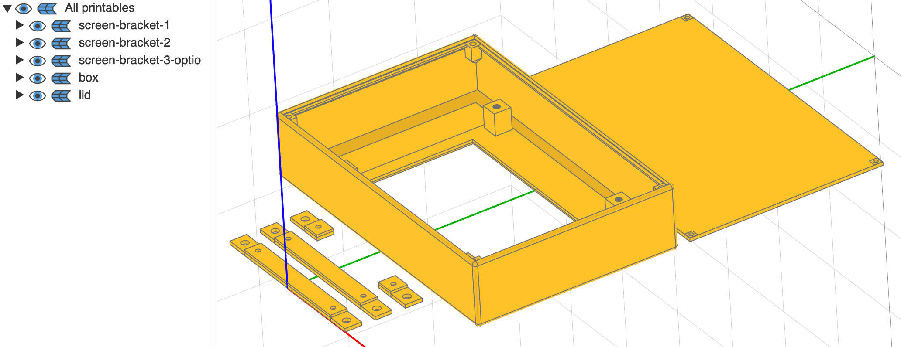
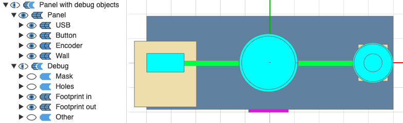

# cq_enclosure_builder
Generate printable enclosures for projects in a few lines of code. Some features:
- Pre-designed common parts (jacks, barrel plug, USBs, etc.);
    - Easy to add your own parts (e.g. the specific model of SPST you're using)
- Screwable lid;
- Layout builder;
- Ready-to-print STL export.

| <br><sub>Code to generated the model</sub> | <br><sub>Model preview</sub> | <br><sub>TODO REPLACE PLACEHOLDER Printed result</sub> |
|:--------------------------:|:---------------------------:|:----------:|

---

- **[Examples](#examples)**
    - **[01 – Panel with buttons](#example-01)**
    - **[02 – Set default part types and parameters](#example-02)**
    - **[03 – Panel's optional parameters](#example-03)**
    - **[04 – Enclosure with buttons](#example-04)**
    - **[05 – Export enclosure STLs](#example-05)**
    - **[06 – Enclosure's optional parameters](#example-06)**
    - **[07 – Layout builder: simple line](#example-07)**
    - **[08 – Layout builder: fixed-width line](#example-08)**
    - **[09 – Layout builder: fixed-width line with median part centred at 0,0](#example-09)**
    - **[10 – Layout builder: grid of parts](#example-10)**
    - **[11 – Layout builder: combining groups](#example-11)**
    - **[12 – Text](#example-12)**
    - **[13 – Support for parts](#example-13)**
    - **[14 – Support for Raspberry Pi and protoboard](#example-14)**
    - **[15 – Add a new Part](#example-15)**
    - **[16 – All parts](#example-16)**
- **[Available parts](#available-parts)**
    - **[Built-in categories and part types](#available-parts-list-builtins)**
    - **[Adding a new Part](#available-parts-add-new)**
- **[Strength Test](#strength-test)**
    - **[With support](#strength-test)**
    - **[Without support](#strength-test)**
- **[API Reference](#api-reference)**
    - **[Enclosure](#api-reference-enclosure)**
    - **[PartsFactory](#api-reference-parts-factory)**
    - **[LayoutGroup](#api-reference-layout-group)**
    - **[Panel](#api-reference-panel)**
    - **[Part](#api-reference-part)**

---

<a name="examples"></a>
## Examples

To run the [example](./examples/) yourself, you'll need a CadQuery UI, such as [jupyter-cadquery](https://github.com/bernhard-42/jupyter-cadquery) or [cq-editor](https://github.com/CadQuery/CQ-editor). The former is **way** more flexible, but will require you to have a working [Jupyter Notebook/Lab](https://jupyter.org/install) install.

If you haven't installed [CadQuery](https://cadquery.readthedocs.io/en/latest/installation.html) [yet], feel free to check the screenshots below!

([00_all_examples](./examples/00_all_examples.ipynb) contains all the examples in a single Notebook.)

<a name="example-01"></a>
### 01 – Panel with buttons

A single [Panel](#api-reference-panel) (side of an enclosure) with two buttons.


<sub><p align="center">[01_panel_with_button](./examples/01_panel_with_button.py)</p></sub>

<a name="example-02"></a>
### 02 – Set default part types and parameters

Almost the same as above, but shows how `PartsFactory#set_default_types` and `PartsFactory#set_default_parameters` can help you make your code more readable, by removing the need to repeat the `part_type` (e.g. with specific model of SPST you're using for your project), and removing the need to repeat common parameters such as `enclosure_wall_thickness`.


<sub><p align="center">[02_default_part_type_and_parameters](./examples/02_default_part_type_and_parameters.py)</p></sub>

<a name="example-03"></a>
### 03 – Panel's optional parameters

Shows optional parameters for the `Panel` class (see [API Reference](#api-reference-panel)). Here, we've updated the panel colour, the part colour, and the panel's transparency.


<sub><p align="center">[03_panel_optional_params](./examples/03_panel_optional_params.py)</p></sub>

<a name="example-04"></a>
### 04 – Enclosure with buttons

A simple [Enclosure](#api-reference-enclosure) with an 'exploded' view.


<sub><p align="center">[04_enclosure_with_button](./examples/04_enclosure_with_button.py)</p></sub>

<a name="example-05"></a>
### 05 – Export enclosure STLs

`Enclosure#export_printables` will create ready-to-print STLs files for each separate parts of your project. For most enclosures, it will be a **lid** and the rest of the enclosure (**box**); in some cases, some components requires additional prints, such as brackets to hold a screen.


<sub><p align="center">[05_export_enclosure_stls](./examples/05_export_enclosure_stls.py)</p></sub>

<a name="example-06"></a>
### 06 – Enclosure's optional parameters

Shows optional parameters for the `Enclosure` class (see [API Reference](#api-reference-enclosure)). Here, we've updated a few parameters, but the most visibles in the screenshot below is that we've removed the fillet (rounded corners) on the top and bottom of the enclosure.


<sub><p align="center">[06_enclosure_optional_params](./examples/06_enclosure_optional_params.py)</p></sub>

<a name="example-07"></a>
### 07 – Layout builder: simple line

Using [LayoutGroup](#api-reference-layout-group) to build a simple line of three components. See optional parameters to center the line on (0,0), add margin between each element, etc.


<sub><p align="center">[07_layout_builder_simple_line](./examples/07_layout_builder_simple_line.py)</p></sub>

<a name="example-08"></a>
### 08 – Layout builder: fixed-width line

Line of N components taking all the available space. Here, we're aligning the parts by their 'external footprint': the outwards facing part of the components, such as the hole of a USB, or the knobs of potentiometers.

In the screenshot below, the beige rectangle represents the PCB to which the USB A connector is attached, which is larger than the USB port itself. (Of course, in this example, the board would be sticking out of the enclosure!)


<sub><p align="center">[08_layout_builder_fixed_width_line](./examples/08_layout_builder_fixed_width_line.py)</p></sub>

<a name="example-09"></a>
### 09 – Layout builder: fixed-width line with median part centred at (0,0)

Fixed-width line, but we want to force the median element (here, the second out of three) to be at (0,0). This won't be the case by default if the footprint of the element[s] on its left and the footprint of the element[s] on its right is not equal. (Yes, this means that the elements aren't equally-spaced anymore, but is useful in some cases.)


<sub><p align="center">[09_layout_buider_fixed_width_line_centre_at_0_0](./examples/09_layout_buider_fixed_width_line_centre_at_0_0.py)</p></sub>

<a name="example-10"></a>
### 10 – Layout builder: grid of parts

Create a grid of any component (6.35mm jacks in this case). You can define the number of rows and columns, as well as the spacing between them.


<sub><p align="center">[10_layout_builder_grid_of_parts](./examples/10_layout_builder_grid_of_parts.py)</p></sub>

<a name="example-11"></a>
### 11 – Layout builder: combining groups

[LayoutGroup](#api-reference-layout-group) (and `LayoutElement`) can be combined together: here, we have two grid of jacks (6.35mm and 3.5mm), and a single USB A, equally spread on the panel.


<sub><p align="center">[11_layout_builder_combining_groups](./examples/11_layout_builder_combining_groups.py)</p></sub>

<a name="example-12"></a>
### 12 – Text

You can add extruded and cut text (e.g. for your project's name and version).


<sub><p align="center">[12_text](./examples/12_text.py)</p></sub>

<a name="example-13"></a>
### 13 – Support for parts

If you have free space under your parts under heavy stress (e.g. the switch on a guitar pedal), you can add a support pillar underneath.


<sub><p align="center">[13_support_for_part](./examples/13_support_for_part.py)</p></sub>

<a name="example-14"></a>
### 14 – Holders for Raspberry Pi and protoboard

Screws to hold your PCBs in place.

For the protobard, the screws can be positioned arbitrarily (grid coordinates).


<sub><p align="center">[14_support_for_pi_and_protoboard](./examples/14_support_for_pi_and_protoboard.py)</p></sub>

<a name="example-15"></a>
### 15 – Add a new Part

See **[Adding a new Part](#available-parts-add-new)** for more details.


<sub><p align="center">[15_add_new_part](./examples/15_add_new_part.py)</p></sub>

<a name="example-16"></a>
### 16 – All parts

Show all available parts. Note: the default caps/knobs are shown, but there's a dozen available, and more can be added by taking four simple measurements.

For more details, see below.


<sub><p align="center">[16_all_parts.py](./examples/16_all_parts.py)</p></sub>

---

<a name="available-parts"></a>
## Available parts

<a name="available-parts-list-builtins"></a>
### Built-in categories and part types

- **jack**: '6.35mm PJ-612A', '3.5mm XXX'
- **button**: 'SPST PBS-24B-4', 'DPDT PBS-24-212SP', 'PBS 11-A', 'PBS-110'
- **encoder**: 'EC11'
- **potentiometer**: 'WH148'
- **usb_a**: '3.0 vertical cltgxdd'
- **usb_c**: 'ChengHaoRan E'
- **screen**: 'HDMI 5 inch JRP5015', 'DSI 5 inch XXX'
- **air_vent**: 'basic rectangular'
- **banana**: '4mm'
- **barrel_plug**: 'DC-022B'
- **rca**: 'N1030'
- **support**: 'pyramid', 'skirt'
- **toggle**: 'MTS-103'
- **midi**: 'SD-50SN'
- **holder**: 'RPi 4B', 'Protoboard'
- **text**: 'default'

<a name="available-parts-add-new"></a>
### Adding a new Part

See [example 15](#example-15) above.

Each part has a category (`button`, `encoder`, `screen`, etc.)

To create a new part, you can copy the file [__template.py](./src/cq_enclosure_builder/parts/__template.py) somewhere in your project. (If you wish to contribute, copy the file into the appropriate sub-folder of [cq_enclosure_builder/parts](./src/cq_enclosure_builder/parts/).)

```
@register_part("<category>", "<part_type>")
```

If contributing, `<category>` should match the sub-folder, otherwise, it can be anything. `<part_type>` represents the reference of your component (e.g. `PBS 11-A`).

If there's no category matching your part, it's not an issue: a new build method `PartsFactory#build_<your new category>` will automatically be added to the factory. (If contributing, simply create a new sub-package in the folder mentioned above.)

You'll now be able to use your part:
```
from cq_enclosure_builder import PartsFactory as pf

my_part = pf.build_<category>(part_type="<part_type>")
```

**Note 1:** set your part as default for this category with `PartsFactory#set_default_types`.

**Note 2:** you don't need to use `@register_part`, it only allows your to use [PartsFactory](./src/cq_enclosure_builder/parts_factory.py) and its built-in cache. If not, simply instantiate your object as you normally would (`MyPart()`).

---

<a name="strength-test"></a>
## Strength test

The enclosures should be strong enough for most enclosure needs, including guitar pedals (which endure stomping!)

I've made to tests using [this PLA](https://www.amazon.de/dp/B09KL2JYT6) (code [here](./examples/strength_test_enclosures.py)):
- the first one was made with nothing supporting the SPST;
- the second one had a small 'pillar' underneath it (see [example 13](#example-13) above), making it very solid with reasonable use. (If you PCB design is flexible, you can plan for a small hole to allow the pillar to support the bottom of the SPST.)


|  |  |
|:------------------------------------:|:-------------------------------------:|

---

<a name="api-reference"></a>
## API Reference

**TODO!**

<a name="api-reference-enclosure"></a>
### class: [Enclosure](./src/cq_enclosure_builder/enclosure.py)

| Method Name | Parameters | Description |
|-------------|------------|-------------|
| `__init__`  | - `param1`: Type Description<br>- `param2`: Type Description | Constructor |

---

<a name="api-reference-parts-factory"></a>
### class: [PartsFactory](./src/cq_enclosure_builder/parts_factory.py) (layout builder)

| Method Name | Parameters | Description |
|-------------|------------|-------------|
| `__init__`  | - `param1`: Type Description<br>- `param2`: Type Description | Constructor |

---

<a name="api-reference-layout-group"></a>
### class: [LayoutGroup](./src/cq_enclosure_builder/layout_builder/layout_group.py) (layout builder)

| Method Name | Parameters | Description |
|-------------|------------|-------------|
| `__init__`  | - `param1`: Type Description<br>- `param2`: Type Description | Constructor |

---

<a name="api-reference-panel"></a>
### class: [Panel](./src/cq_enclosure_builder/panel.py)

| Method Name | Parameters | Description |
|-------------|------------|-------------|
| `__init__`  | - `param1`: Type Description<br>- `param2`: Type Description | Constructor |

---

<a name="api-reference-part"></a>
### class: [Part](./src/cq_enclosure_builder/part.py)

| Method Name | Parameters | Description |
|-------------|------------|-------------|
| `__init__`  | - `param1`: Type Description<br>- `param2`: Type Description | Constructor |

---

If there's any problem, feel free to open a PR, or create an issue; thanks!